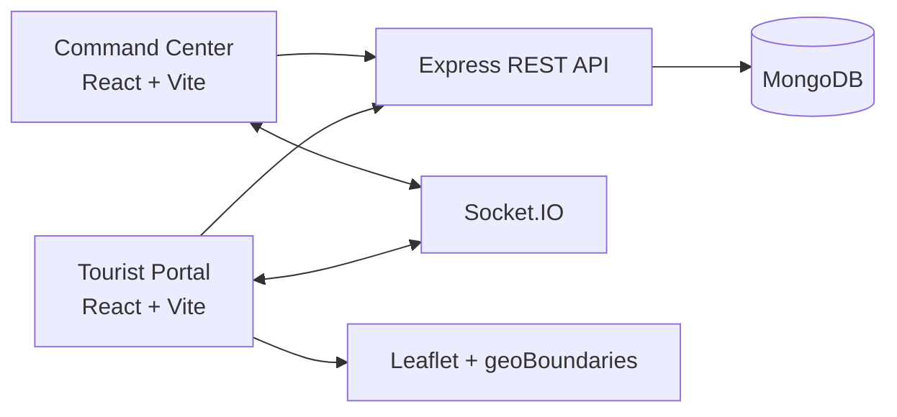

# 🛡️ Safar Setu - Tourist Safety & Emergency Rescue Platform


Safar Setu is a dual-portal safety network for tourists and police or rescue teams. It
combines one-touch SOS dispatch, GPS-aware safety zones, verified incident intelligence, and ICE
contacts in a presentation-ready Smart India Hackathon prototype.

A comprehensive **MERN Stack** (**M**ongoDB, **E**xpress.js, **R**eact, **N**ode.js) platform built with real-time Socket.IO communication, designed for traveler protection, emergency SOS broadcasts, safety zone navigation, and authority command & dispatch control.

---

## Problem Statement

Tourists move through unfamiliar cities, remote circuits, and permit-controlled regions where
fragmented helplines, language barriers, and limited local context can delay a response. Existing
reports are difficult for responders to verify and command teams often lack a live, location-linked
queue of tourist distress calls.

Safar Setu addresses this gap with one tourist workflow and one responder workflow backed by
the same authenticated API and real-time event channel.

## Key Features

- 🚨 **One-Touch Emergency SOS**: Instant panic distress button capturing device GPS coordinates and broadcasting to responders in real time.
- 📡 **Real-Time Dispatch Console (Socket.IO)**: Police & Rescue Command Center for monitoring incoming alerts, deploying response units, and resolving emergencies.
- 🗺️ **Safe Havens & Caution Zones**: Perimeter monitoring with real-time risk assessment and distance calculation.
- ⚠️ **Crowd-Sourced Incident Reporting**: Verified community reports on pickpocketing, scams, harassment, medical hazards, and travel risks.
- 📞 **In Case of Emergency (ICE) Contacts**: Direct SMS and call triggers for primary emergency contacts.
- 🔐 **Role-Based Access Control**: Tailored portals for **Tourists** and **Admins** (Police & Rescue Command).

---

## Project Architecture

```
tourist-safety-app/
├── package.json              # Root orchestration (concurrently runs client & server)
├── .env.example              # Environment variable template
├── server/                   # Backend (Node.js, Express.js, MongoDB / Mongoose, Socket.io)
│   ├── src/
│   │   ├── config/           # MongoDB connection handler
│   │   ├── models/           # Mongoose schemas (User, SOSAlert, IncidentReport, SafetyZone, etc.)
│   │   ├── controllers/      # Business logic & socket broadcasters
│   │   ├── routes/           # REST endpoints (/api/auth, /api/sos, /api/incidents, /api/safety-zones)
│   │   ├── middleware/       # JWT auth & error handling
│   │   ├── seed.ts           # Demo database seed script
│   │   └── server.ts         # Server bootstrap
│   └── package.json
└── client-tourist/           # Tourist Portal (React 19, Vite, vanilla CSS)
└── client-admin/             # Admin & Dispatch Command Center (React 19, Vite, vanilla CSS)```

---



Both portals use a shared visual language built from vanilla CSS custom properties and semantic
component classes with no utility framework required at runtime or build time.

## Screenshots

Add final pitch screenshots here:

- `docs/screenshots/tourist-dashboard.png`
- `docs/screenshots/command-center.png`
- `docs/screenshots/safety-zones.png`

## Team

Replace these role placeholders with the registered SIH team before submission:

| Role | Team member |
|------|-------------|
| Product and pitch lead | Team Member 1 |
| Backend and realtime systems | Team Member 2 |
| Frontend and UX | Team Member 3 |
| Geo intelligence and research | Team Member 4 |

## Getting Started

### 1. Prerequisites
- **Node.js** (v18+ recommended)
- **MongoDB** (Local instance running at `mongodb://127.0.0.1:27017` or MongoDB Atlas URI)

Authentication requires a reachable MongoDB database. For MongoDB Atlas, add the machine running
the server to the cluster Network Access IP allowlist and verify `server/.env` contains a valid
`MONGO_URI`. The API now stops at startup when MongoDB is unavailable instead of accepting auth
requests that can only time out.

### 2. Setup Environment
Ensure your `.env` in `server/.env` (and root `.env`) has:
```env
PORT=5000
MONGO_URI=mongodb://127.0.0.1:27017/tourist_safety_db
JWT_SECRET=super_secret_jwt_key_tourist_safety_2026
CLIENT_URL=http://localhost:3000
```

### 3. Install All Dependencies
```bash
npm run install:all
```

### 4. Seed Demo Data (Optional)
To populate demo users (Tourist and Admin) and initial safe zones:
```bash
npm run seed
```

### 5. Run the Application
Start both the Express backend (`http://localhost:5000`) and the React clients concurrently:
```bash
npm run dev
```

- **Tourist Portal**: [http://localhost:3000](http://localhost:3000)
- **Police & Rescue Command Center**: [http://localhost:3002](http://localhost:3002)
- **API Health Check**: [http://localhost:5000/api/health](http://localhost:5000/api/health)

---

## Demo Accounts

| Role | Email | Password | Access |
|------|-------|----------|--------|
| **Tourist** | `tourist@safetour.app` | `password123` | SOS Panic Button, Contacts, Incident Reporting |
| **Admin** | `admin@safetour.app` | `password123` | Real-time SOS Dispatch, Incident Verification, Safety Zone Management |

## Production Docker Deployment

Copy `.env.production.example` to `.env.production`, replace every placeholder, and rotate any
previously exposed credentials before deployment. Then run:

```bash
docker compose -f docker-compose.prod.yml up --build -d
```

The production stack serves the Tourist Portal on port `3000`, the Police Command Center on port
`3002`, and the API on port `5000`. MongoDB uses the persistent `mongo_data` volume. The Nginx
configs proxy `/api` and `/socket.io` to the server and support React client-side routes.

Check the API with `http://localhost:5000/api/health`. Stop the stack with:

```bash
docker compose -f docker-compose.prod.yml down
```
